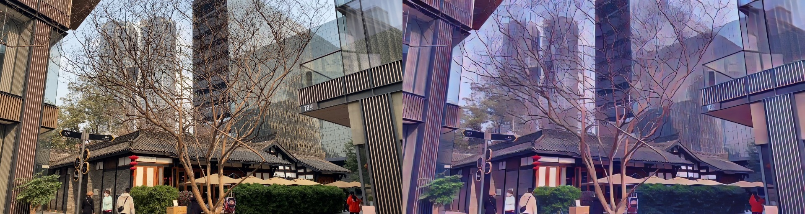
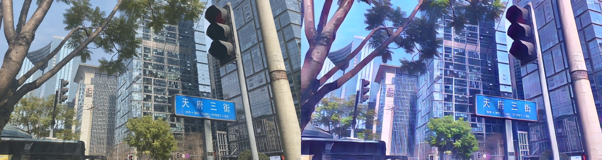
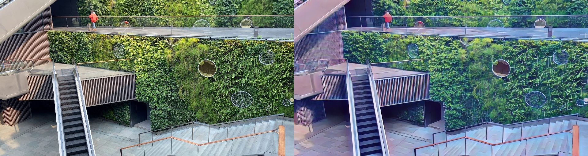
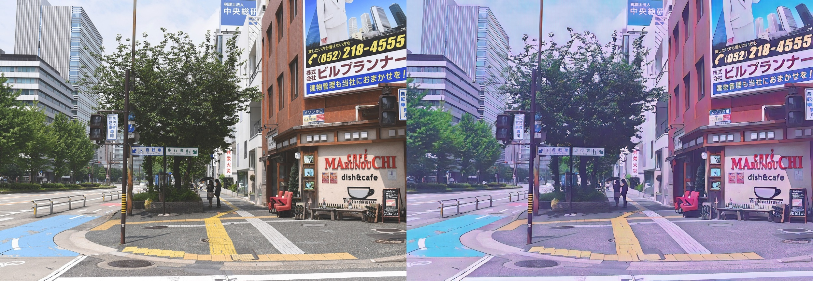
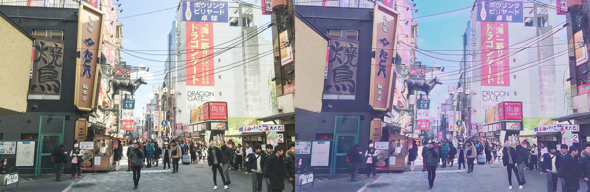
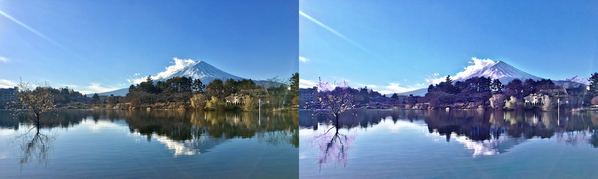

# AnimeGAN
「Open Source」. The pytorch implementation of AnimeGAN.  
「动画风格生成，用AI拍出一部属于自己的动漫」

## 数据集
[下载地址](https://github.com/TachibanaYoshino/AnimeGAN/releases/tag/dataset-1)   
训练数据结构设计
```
|_datasets  
|__animegan  
|___Shinkai(画家风格)  
|_____train(训练数据)  
|________real(真实数据)  
|________style(风格数据)  
|________smooth(经过处理的风格数据)  
|_____test(测试数据)  
|________real(真实数据)  
```

## 训练
```
# 单卡
python tools/train_net.py \
--config-file "path/to/config" \
SOLVER.IMS_PER_BATCH 8

# 多卡
python -m torch.distributed.launch --nproc_per_node=8 \
/tools/train_net.py \
--config-file "path/to/config" \
SOLVER.IMS_PER_BATCH 8
```

## 模型下载
* 预训练模型  
链接: https://pan.baidu.com/s/12mCSoACTE4sXA4ycQN0YmA  
密码: 9tau  
* shinkai风格模型  
链接: https://pan.baidu.com/s/1yG_BxCGrBqsVITqE5Vx6dw  
密码: 6tp4  
* hayao风格模型  
链接: https://pan.baidu.com/s/19PMLNO-lQ0tH0DwQjz_XMg  
密码: cs27  

## 图片转换
```
# --config-path 配置文件路径
# --image 图像路径
# MODEL.WEIGHT 模型文件路径
python scripts/image2anime.py \
--config-file "your_config_path" \
--image "your_image_path" \
MODEL.WEIGHT "your_model_path"
```

## 视频转换
```
# --config-path 配置文件路径
# --video 视频路径
# MODEL.WEIGHT 模型文件路径
python scripts/image2anime.py \
--config-file "your_config_path" \
--video "your_video_path" \
MODEL.WEIGHT "your_model_path"
```

## demo
:heart_eyes:  Photo  to  Shinkai  Style 



:heart_eyes:  Photo  to  Hayao  Style


 

## Thanks
Thanks for [TachibanaYoshino](https://tachibanayoshino.github.io/AnimeGANv2/)